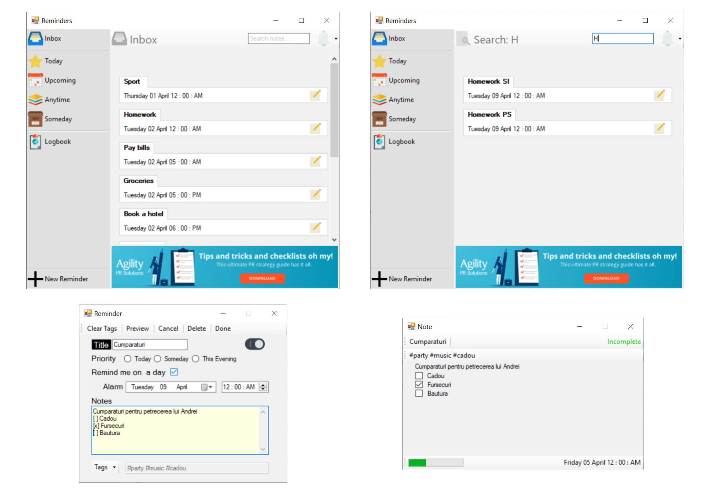

## Application Interface
The interface was designed using windows forms application, within Visual Studio. Windows Forms application is one that runs on the desktop computer and it will normally have a collection of controls such as labels, textboxes, list boxes... To give a better look, the application contains images.

