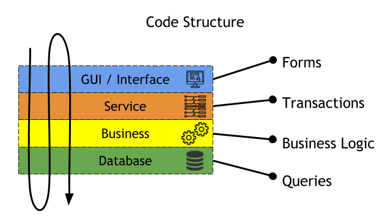

## Patterns
Domain Layer Pattern: **Table Module**

A Table Module organizes domain logic with one class per table in the data-base, and a single instance of a class contains the various procedures that will act on the data.

Data Source Pattern: **Table Data Gateway**

It handles Database interface only and is not supposed to contain any Business Logic. A Table Data Gateway holds all the SQL for accessing a single table or view: selects, inserts, updates, and deletes. Other code calls its methods for all interaction with the database.

