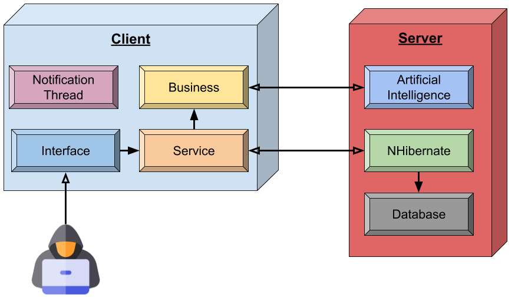

## Deployment Diagram

A UML deployment diagram is a diagram that shows the configuration of run time processing nodes and the components that live on them. It describes the physical deployment of information generated by the software program on hardware components. Deployment diagrams is a kind of structure diagram used in modeling the physical aspects of an object-oriented system.

Deployment diagrams are made up of several UML shapes. The three-dimensional boxes, known as nodes, represent the basic software or hardware elements, or nodes, in the system. Lines from node to node indicate relationships, and the smaller shapes contained within the boxes represent the software artifacts that are deployed.

