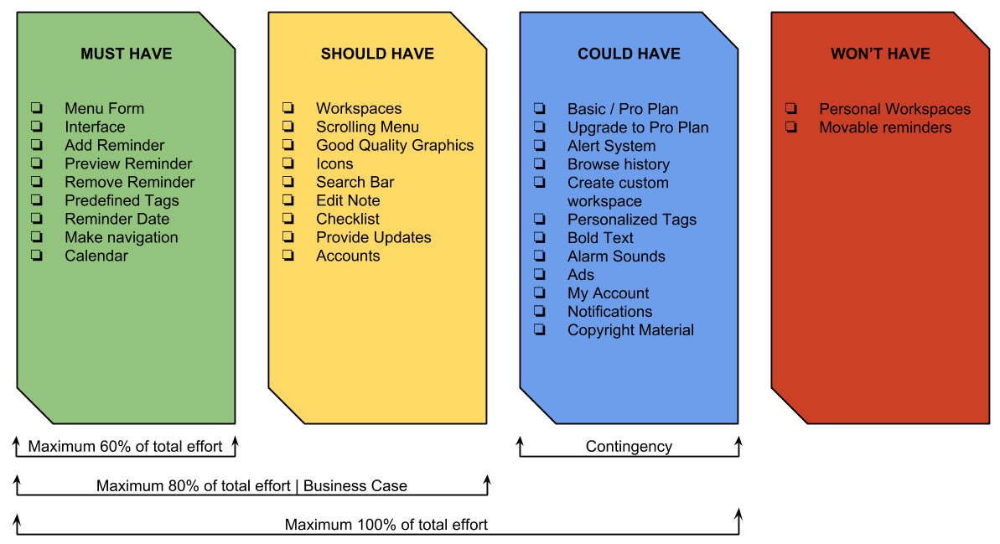

## MoSCoW
The MoSCoW method provides a simple way of clarifying the priorities involved on a project. It’s most useful in time bound situations and it can be used to prioritize your own workload.

**Must have:** These are the requirements without which a project will fail. They MUST be delivered within the time-frame in order for anyone involved with the project to move on. In essence they make up the MVP (Minimum Viable Product) though it can be argued that MUST could stand for Minimum Usable Subset too.

**Should have:** These aren’t 100% necessary for delivering the project successfully but they are the _most nice to have_ out of the list. They may be less time critical than “must have” or might be better held for a future release.

**Could have:** These are just _nice to have_ they are desirable to provide a nice user experience or customer experience but they’re not that important to the delivery of the project. They will be delivered only if there’s enough time and resources to spare to devote to them. Otherwise, they’re likely to be tabled for future releases and re-reviewed to see if they have become higher or lower priority in the interim.

**Won’t have:** These are the requirements that everyone agrees aren’t going to happen. It might be because they cost too much to implement or provide too little ROI (Return On Investment) for the efforts required to implement them. These are simply left to one side until they are either removed from the requirements list or become a higher priority.

