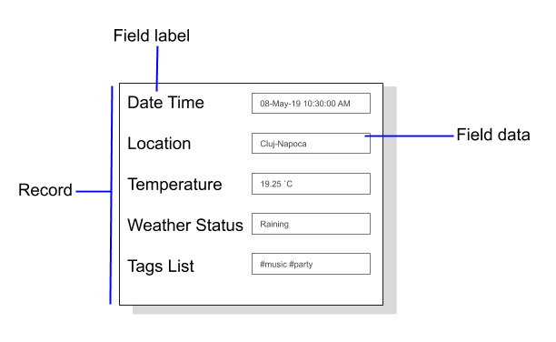

## Classes
**Server _(HOST)_** 
* Program: Service host creation on localhost
* **App.config**

**Client**
* Program: Data received, transformed and then transmited back to sender.
* ArtificialIntelligence: Class model for storing data.
* Datastatic: A static class can’t be instantiated and it may only contain static members (methods and attributes).
* Weather API (OpenWeatherAPI, Main, Query, Clouds, Coord, Rain, Snow, Sys, Weather, Wind)

**AppToDo**
* See [Iteration 2 Classes](../../Iteration_1/Packages/classes.md)

