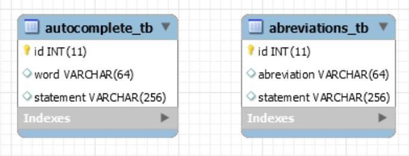

## Database
In order to update a table without a **WHERE** that uses a **KEY** column we have to disable the safe mode. To toggle the option we have to go in Preferences -> SQL Editor and reconnect.

``Error Code: 1175``

