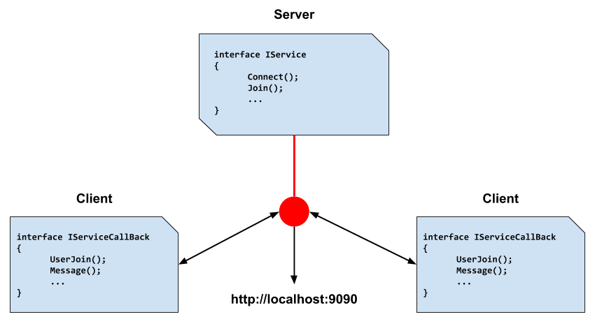

## WCF Service
Windows Communication Foundation (WCF) is a unified framework for creating secure, reliable, transacted, and interoperable distributed applications.

**The WCF programming model** is based on communication between two entities: a WCF service and a WCF client. The programming model is encapsulated in the System.ServiceModel namespace in the .NET Framework.

WCF service is based on an interface that defines a contract between the service and the client. It is marked with a _ServiceContractAttribute_ attribute:

``[ServiceContract]``
``public interface IService1``

You define functions or methods that are exposed by a WCF service by marking them with a _OperationContractAttribute_ attribute.

``[OperationContract]``

``string GetData(string value);``

WCF client consists of a proxy that enables an application to communicate with a WCF service, and an endpoint that matches an endpoint defined for the service. The proxy is generated on the client side in the _App.config_ file and includes information about the types and methods that are exposed by the service.

### Running App
! To successfully run the Service application, the HTTP have to be registered URL http://localhost:9090 (baseAddress). In order to do that, we have to **Run as Administrator** the Service applciation.

Framework (Add Service Reference):
* System.ServiceModel

