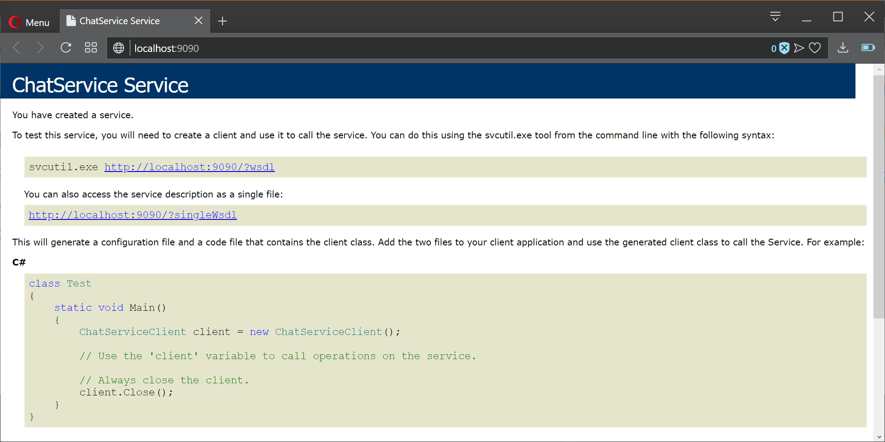

## Data Transmited
Data is sent via WCF from Client 1 to Client 2 as a message, then it is divided in sections and then Client 2 sends a coded message to Client 1 as the following:

**DLHATW [D1 D2 D3] [L] [H1 H2 ... Hn \n] [T] [W] [A] [@/message]**

_D_ (Date), _L_ (Location), _H_ (Hashtags), _A_ (Autostatement), _T_ (Temperature in \`C) and _W_ (Weather) can be optional, transmited as _X_. _@_ means that there's no message to be read. Client 1 will decode message and it will apply some patterns to the text.

**Example of coded message:**

``DXHATW 08-May-19 10:30:00 AM #party #music \n 29 19.25 Raining Just listen this #music #party as soon as possible p``

**Decoded message:**
```
Date: 08-May-19 10:30:00 AM
Location:
Hashtags: #party #music
Temperature: 19.25 `C
Weather: Raining
Message: Just listen this #music #party as p
```
All this information is sent via localhost address which can be configured in _App.config_ file.

**Example of App.config configuration:**
```
<?xml version="1.0" encoding="utf-8" ?>
<configuration>
    <startup> 
        <supportedRuntime version="v4.0" sku=".NETFramework,Version=v4.6.1" />
    </startup>
  <system.serviceModel>
    <services>
      <service name="Host.ChatService">
        <endpoint address=""
                  binding="wsDualHttpBinding"
                  contract="Host.IChatService">
        </endpoint>
        <host>
          <baseAddresses>
            <add baseAddress="http://localhost:9090"/>
          </baseAddresses>
        </host>
      </service>
    </services>
    <behaviors>
      <serviceBehaviors>
        <behavior>
          <serviceMetadata httpGetEnabled="true"/>
        </behavior>
      </serviceBehaviors>
    </behaviors>
  </system.serviceModel>
</configuration>
```

