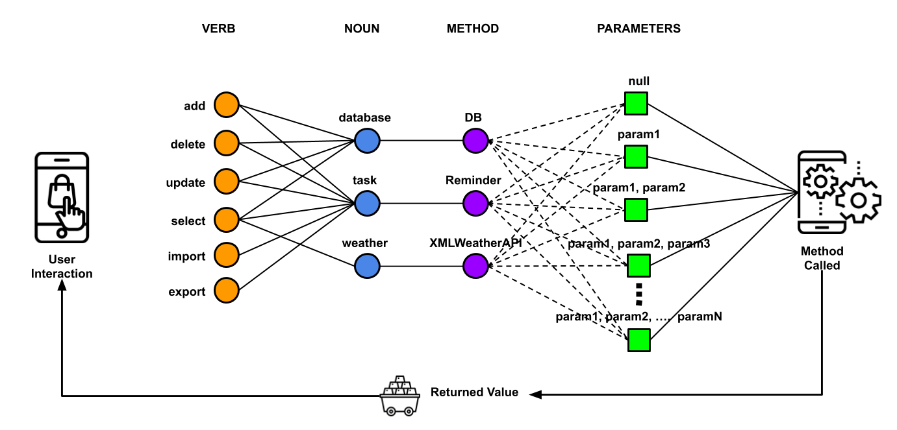
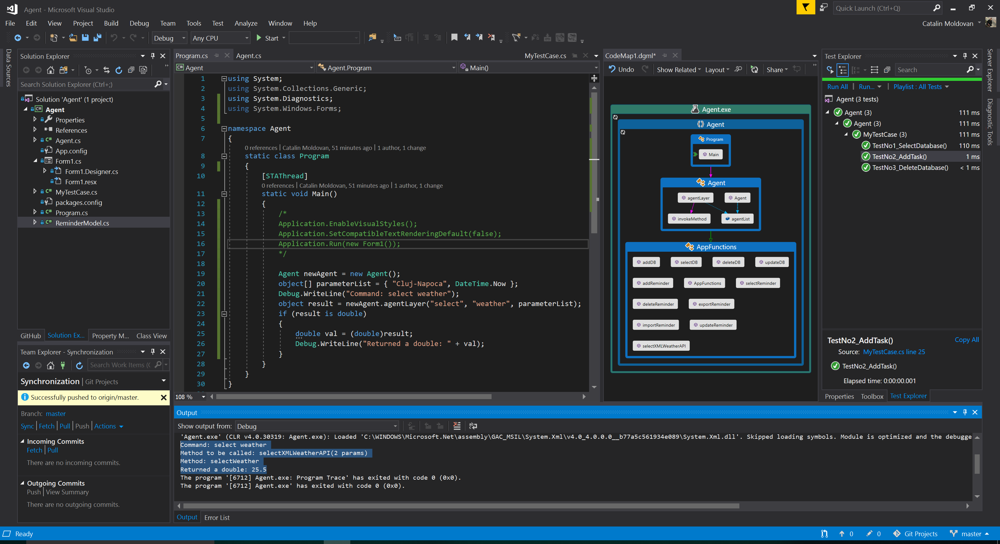

## Agent
This solution doesn't use conditions and the programme don't know how many methods will be called (refereced) by the Agent. The concept is based of calling the method formed by a string. This string is created based on the verb and the noun's method.

First I created some test methods which can return a value or not (void/int/string/double,List<Model>,List<string>,Model...). These methods can have no parameters, or just one, or 2,3, etc. When the programme has to call a method, it will pass the code (verb + noun) and a list of parameters (for calling the method). The Agent will check for the verb which will show the noun, then we'll know which is the method to be called. The method to be called is formed by verb + method's name. Now, we will invoke the real method the application wanted to call with the right number of parameters. After that, data is returned (if it's necesary) to the app where the Agent was called.

Example of successful command
```
Command: select weather
Method to be called: selectXMLWeatherAPI(2 params)
Method: selectWeather
Returned a double: 25.5
```

Example of unsuccessful command
```
Error, no agent was found!
```



You can see in the picture below the Diagram of the code. The Agent class know that it has to use the AppFunctions class, but the Agent doesn't know if it will call a method of AppFunctions.

An example of the code output is shown in the _Output box_. I also tested 3 different methods with 0, 1 and 2 parameters using NUnit.

