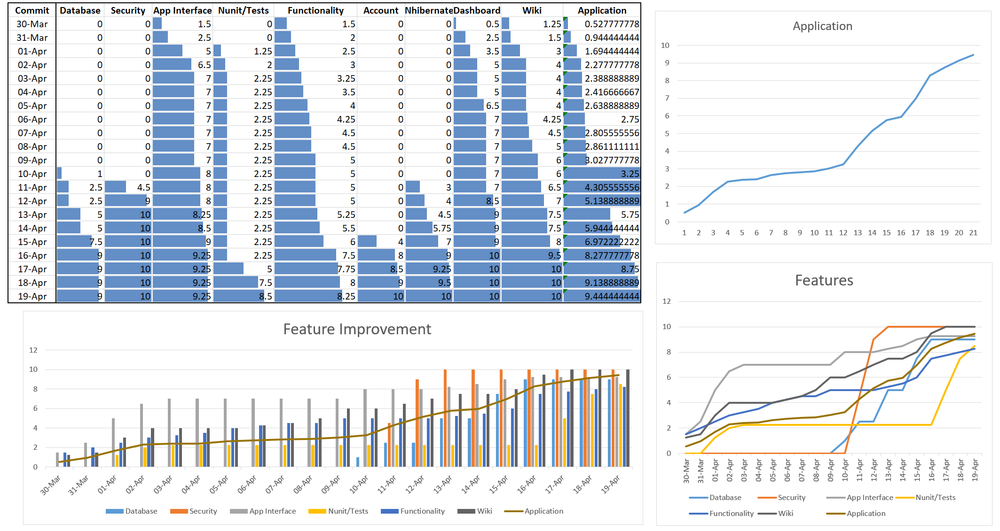

## Project
A list of requirements was made on Github, which contains tasks and issues. It was used a Kanban template so that, every task pass trough some columns: _To Do_, _In progress_ and _Done_. A new column was added, called _Blocked_, which refers to tasks which were once in progress, but at one point it wasn't so important that feature. These task have to be completed until the deadline. All issues raised are stored in _To Do_ columns of project.

<button class="btn js-toggle-dark-mode">Preview dark color scheme</button>

