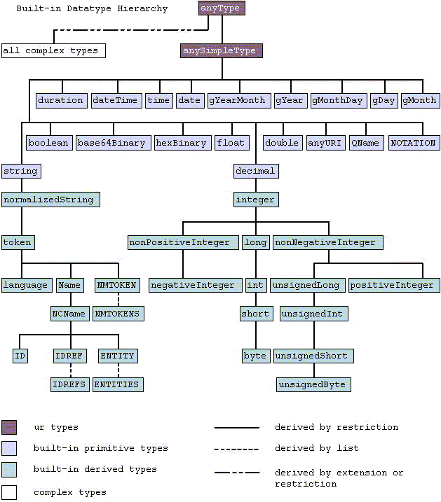

## XML
**Extensible Markup Language** (XML) is a markup language that defines a set of rules for encoding documents in a format that is both human-readable and machine-readable. The language is widely used for the representation of arbitrary data structures such as those used in web services.

XML's basic data types are:
* **string**
* **boolean**
* **decimal, float, double**
* **duration, dateTime, time, date...**

