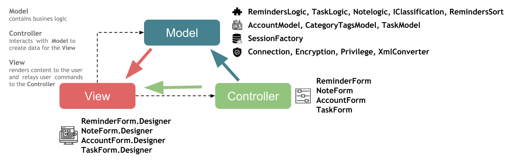

## Classes
**Program:** Main code for opening the forms is placed in _Program_ class. The Main function is STAThread, Single-Threaded Apartment Thread Attribute, so that the application is not using the multithreaded apartment model, which is not supported for Windows Forms. The forms classes are stored in a sealed class, preventing other classes from inheriting from it (equivalent of Java's final in C#, but applied just for classes or methods).

**DataStatic:** Passing values between Forms's data and DB's data are made using a static class. A static class can't be instantiated and it may only contain static members (methods and attributes).

**TaskLogic:** There's the logic for adding tags from a predefined list. Also there are different transformations, from list to string and reverse.

**RemindersLogic:** This class has the responsibility to find user's interaction, and finding different objects in scene.

**NoteLogic:** This class is more special to others. His job is to follow user's note. Find all hashtags presented in note and add checkboxes.

**IClassification & RemindersSort:** In order to obtain a different sorting of reminders by date, priority or status, we have to make the logic. In order to do that, the class has to implement all methods described in IClassification interface. The class implements IClassification interface, so it's required to implement all of the methods and properties. It's like a contract in which the user has to accomplish all tasks. The methods returns sorted tasks as a list.

**Category & Tag:** These classes have specific attributes for tagging the notes. They are usually used as lists for storing information received from DB.

**Task:** A model class with specific attributes like title, priority, date, note, list of tags, status, etc.

**MyTestCase:** NUnit is a tool designed for testing application components. Giving expected results, we assure good operations of the application.
