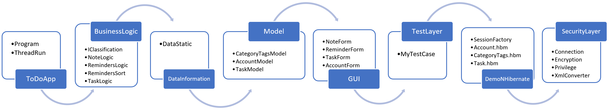

## Packages
The application uses different packages which contains specific classes:

**ToDoApp:** Program, ThreadRun

**BusinessLogic:** IClassification, NoteLogic, RemindersLogic, RemindersSort, TaskLogic

**DataInformation:** DataStatic

**Model:** CategoryTagsModel, AccountModel, TaskModel

**GUI**: NoteForm, ReminderForm, TaskForm, AccountForm

**TestLayer:** MyTestCase

**DemoNHibernate:** SessionFactory, Account.hbm, CategoryTags.hbm, Task.hbm

**SecurityLayer:** Connection, Encryption, Privilege, XmlConverter

