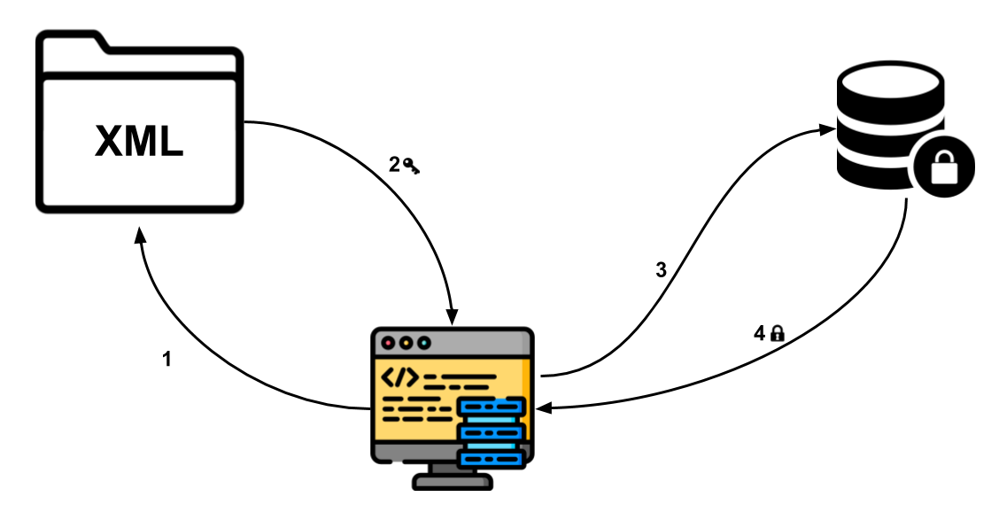

## Security Layer
The security process has 4 steps:
1. Find privileges in XML file
2. User privilege is used for accessing data from DB
3. Decrypt sensitive data and access Database
4. Receive specific data from DB

**Legend:**
* Key -> Encrypted Data
* Padlock -> Limited access

