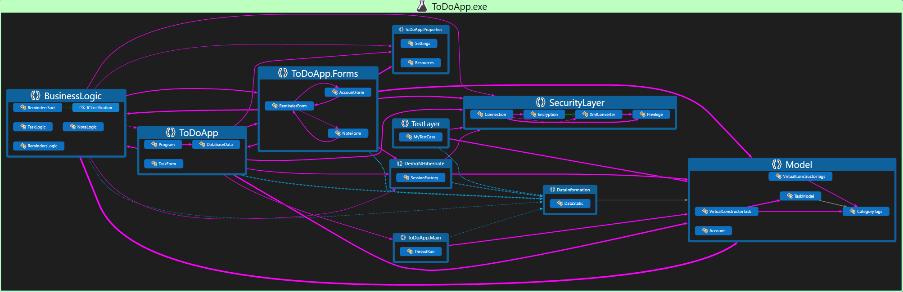

## JSON
JavaScript Object Notation (JSON) is an open-standard file format that uses human-readable text to transmit data objects consisting of attribute–value pairs and array data types.

JSON's basic data types are:
* **Number**: a signed decimal number that may contain a fractional part and may use * exponential E notation.
* **String**: a sequence of zero or more Unicode characters.
* **Boolean**: either of the values true or false.
* **Array**: an ordered list of zero or more values, each of which may be of any type.
* **Object**: an unordered collection of name–value pairs where the names are strings. 
* **null**: An empty value, using the word null

