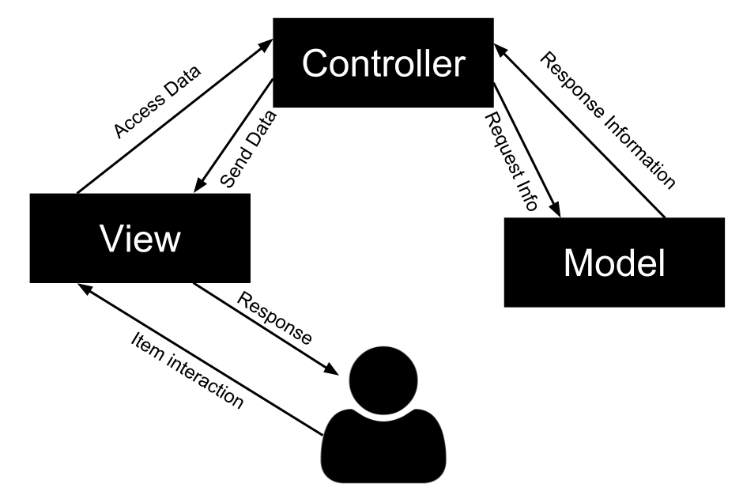

## Model-View-Controller
The application structure is based on Model-View-Controller, but adapted on a C# application. In this situation it's necessary to access the View part which it will send a request to Controller.
* Model is responsible for maintaining application data and business logic.
* View is a user interface of the application, which displays the data.
* Controller handles user's requests and renders appropriate View with Model data.

