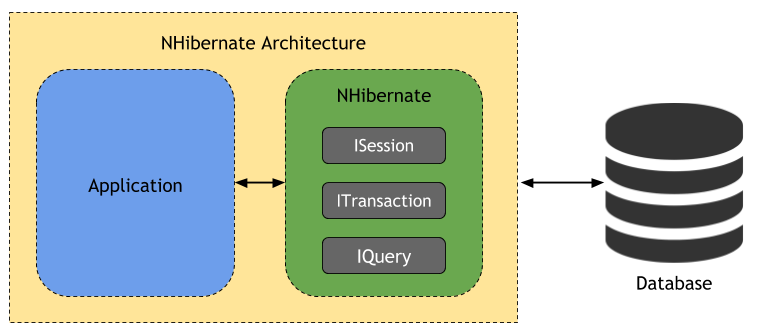

## NHibernate
NHibernate is an object-relational mapping (ORM) solution for the Microsoft .NET platform (equivalent of Java's Hibernate). It provides a framework for mapping an object-oriented domain model to a traditional relational database. NHibernate's primary feature is mapping from .NET classes to database tables and also providing data query and retrieval facilities. NHibernate generates the SQL commands and relieves the developer from manual data set handling and object conversion, keeping the application portable to most SQL databases, with database portability delivered at very little performance overhead.

The application code uses the NHibernate ISession and IQuery APIs for persistence operations and only has to manage database transactions.

