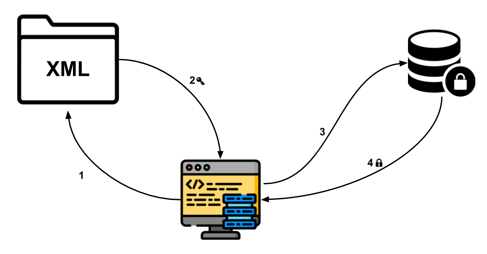

## Security
Sensitive data are encrypted and stored in **XML files**. An encryption and decryption algorithm was implemented using backwards characters. Based on user and password characters, which uses ASCII code, all characters are replaced with other character's code. The way it works is based on left indentation, three characters backwards. [Gravity Falls - _Three letters back_]

**Readonly fields** gives us some flexibility. The value can only be modified during declaration or the execution of the constructor method of the class. This prevent modifying the value, it almost works like a constant (equivalent of Java's final in C#, but applied just for attributes/objects).

**Internal attributes** are accessible only within files in the same assembly and they enable a group of components to cooperate in a private manner without being exposed to the rest of the application code.

## Security Layer
The security process has 4 steps:
1. Find privileges in XML file
2. User privilege is used for accessing data from DB
3. Decrypt sensitive data and access Database
4. Receive specific data from DB

**Legend:**
* Key -> Encrypted Data
* Padlock -> Limited access

